<!-- ========================================================= -->
<!--                     AGENTIC ML AUDIT COPILOT               -->
<!-- ========================================================= -->

<p align="center">

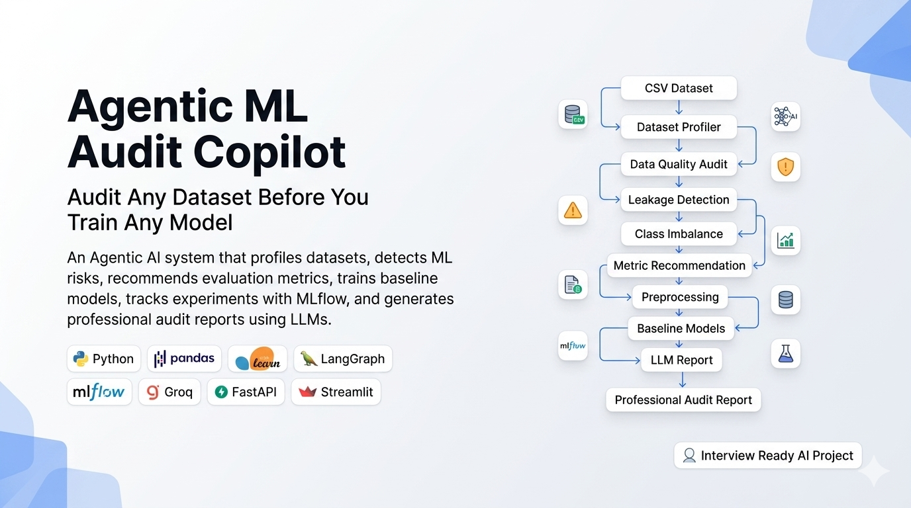

</p>

<h1 align="center">
Agentic ML Audit Copilot
</h1>

<p align="center">

An enterprise-style AI platform that audits tabular datasets before model training.

Detect ML risks • Recommend metrics • Train reliable baselines • Track experiments • Explain predictions • Generate professional audit reports.

</p>

---

<p align="center">


</p>

---

# Overview

Training a machine learning model without understanding the dataset often leads to poor performance, hidden data leakage, misleading evaluation metrics, and unreliable predictions.

**Agentic ML Audit Copilot** performs a complete dataset audit before model training.

Instead of immediately fitting models, the system first analyzes the uploaded dataset, identifies potential risks, recommends appropriate evaluation metrics, builds reliable preprocessing pipelines, trains baseline models, tracks experiments with MLflow, generates explainability insights, and finally prepares a professional audit report.

The project follows a deterministic-first design.

All machine learning computations are performed using Python and Scikit-learn, while the LLM is used only for explanations and report generation.

---

# Key Features

### Dataset Profiling

- Dataset overview
- Data types
- Missing values
- Duplicate rows
- Constant columns
- High-cardinality features
- ID-like column detection

---

### Problem Detection

Automatically identifies

- Binary Classification
- Multiclass Classification
- Regression

---

### Data Quality Audit

Checks for

- Missing values
- Duplicate rows
- Constant features
- High-cardinality columns
- Possible identifier columns

---

### Leakage Detection

Detects possible

- Target duplicates
- Target-like feature names
- Encoded target leakage
- Correlation-based leakage
- Proxy leakage

---

### Metric Recommendation

Automatically recommends suitable metrics.

Classification

- Accuracy
- Precision
- Recall
- F1 Score
- ROC-AUC
- PR-AUC
- Balanced Accuracy

Regression

- RMSE
- MAE
- R² Score
- Median Absolute Error

---

### Class Imbalance Detection

Reports

- Imbalance ratio
- Majority class
- Minority class
- Severity level
- Recommended actions

---

### Automated Preprocessing

Creates production-ready preprocessing pipelines.

Includes

- Missing value imputation
- Standard scaling
- One-Hot Encoding
- ColumnTransformer
- Train/Test split

---

### Baseline Model Training

Classification

- Logistic Regression
- Random Forest Classifier

Regression

- Linear Regression
- Random Forest Regressor

---

### MLflow Integration

Automatically logs

- Parameters
- Metrics
- Models
- Artifacts

---

### Explainability

Supports

- SHAP values
- Feature importance
- Model interpretation

---

### Professional Reports

Generates

- Markdown Report
- JSON Report
- Executive Summary
- LLM Explanation

---

# Architecture

<p align="center">

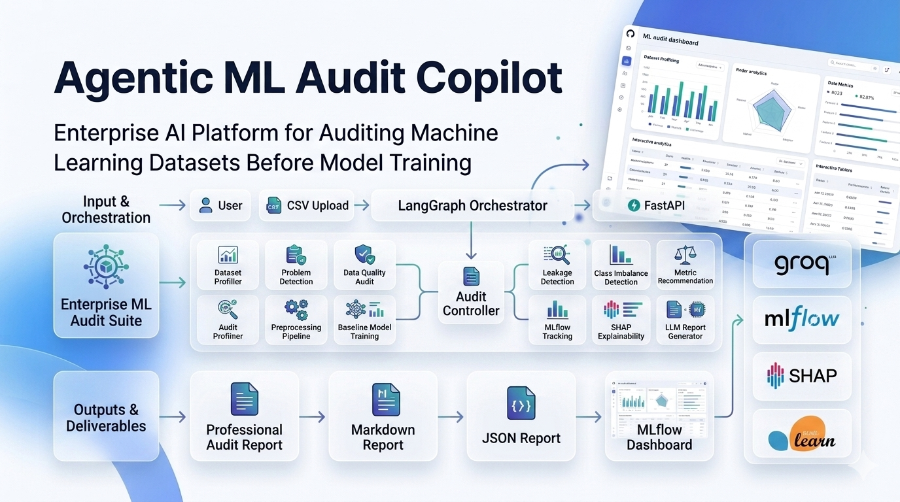

</p>

The platform follows a modular architecture where each audit stage is isolated into its own component.

The LangGraph workflow orchestrates the execution order while individual modules remain deterministic and independently testable.

---

# Complete Workflow

<p align="center">

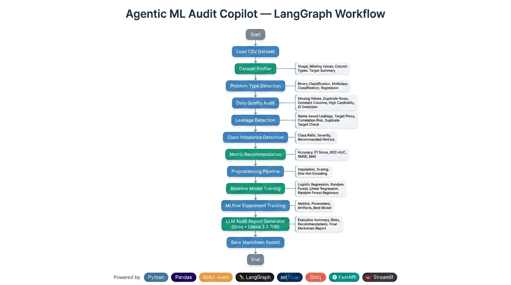

</p>

```
CSV Upload
        │
        ▼
Dataset Profiling
        │
        ▼
Problem Detection
        │
        ▼
Data Quality Audit
        │
        ▼
Leakage Detection
        │
        ▼
Metric Recommendation
        │
        ▼
Class Imbalance
        │
        ▼
Preprocessing
        │
        ▼
Baseline Models
        │
        ▼
MLflow Tracking
        │
        ▼
SHAP Explainability
        │
        ▼
LLM Report
        │
        ▼
Professional Audit Report
```

---

# Technology Stack

| Category | Technologies |
|-----------|--------------|
| Language | Python |
| ML | Scikit-learn |
| Data | Pandas, NumPy |
| Workflow | LangGraph |
| Explainability | SHAP |
| Tracking | MLflow |
| API | FastAPI |
| UI | Streamlit |
| LLM | Groq |
| Testing | Pytest |
| Packaging | uv |
| Containerization | Docker |

---

# Project Highlights

✔ Deterministic-first architecture

✔ Modular audit pipeline

✔ Human Review Dashboard

✔ MLflow experiment tracking

✔ SHAP explainability

✔ LangGraph orchestration

✔ FastAPI REST API

✔ Interactive Streamlit dashboard

✔ Professional audit reports

✔ 96 automated tests

---

# Dashboard Preview

## Home

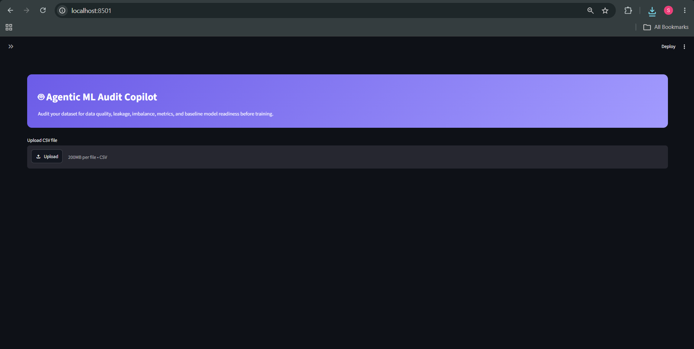

---

## Dataset Upload

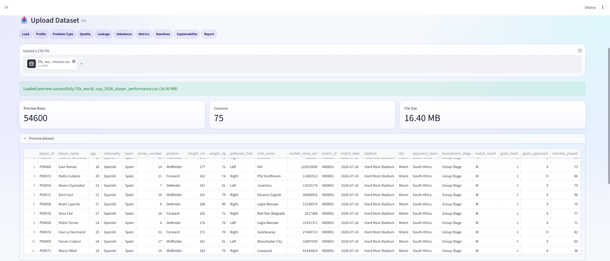

---

## Data Quality

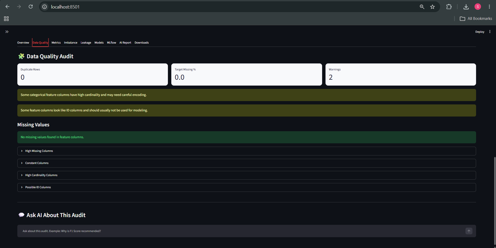

---

## Leakage Detection

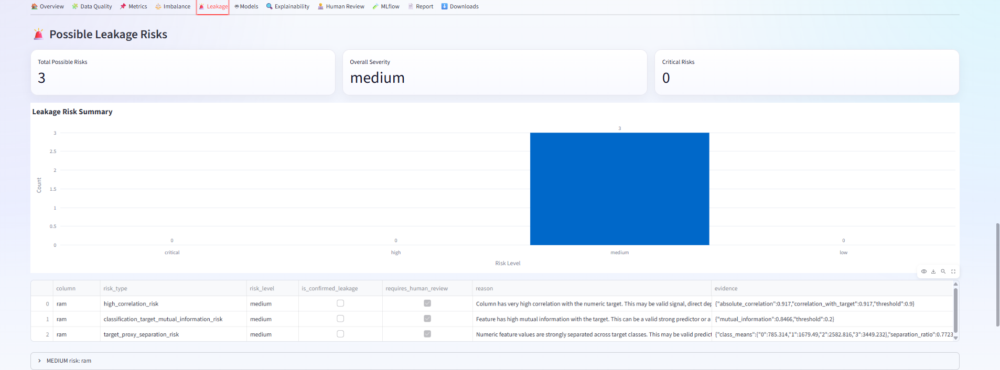

---

## Baseline Models

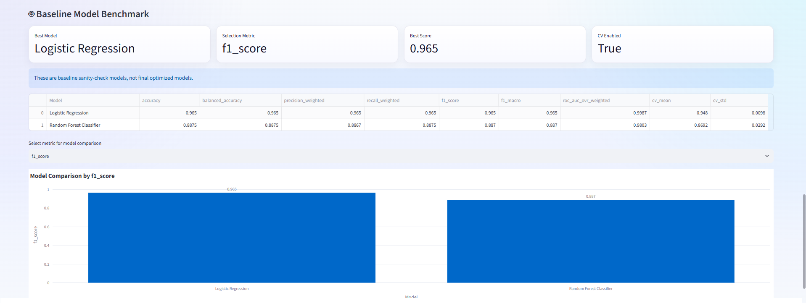

---

## Explainability

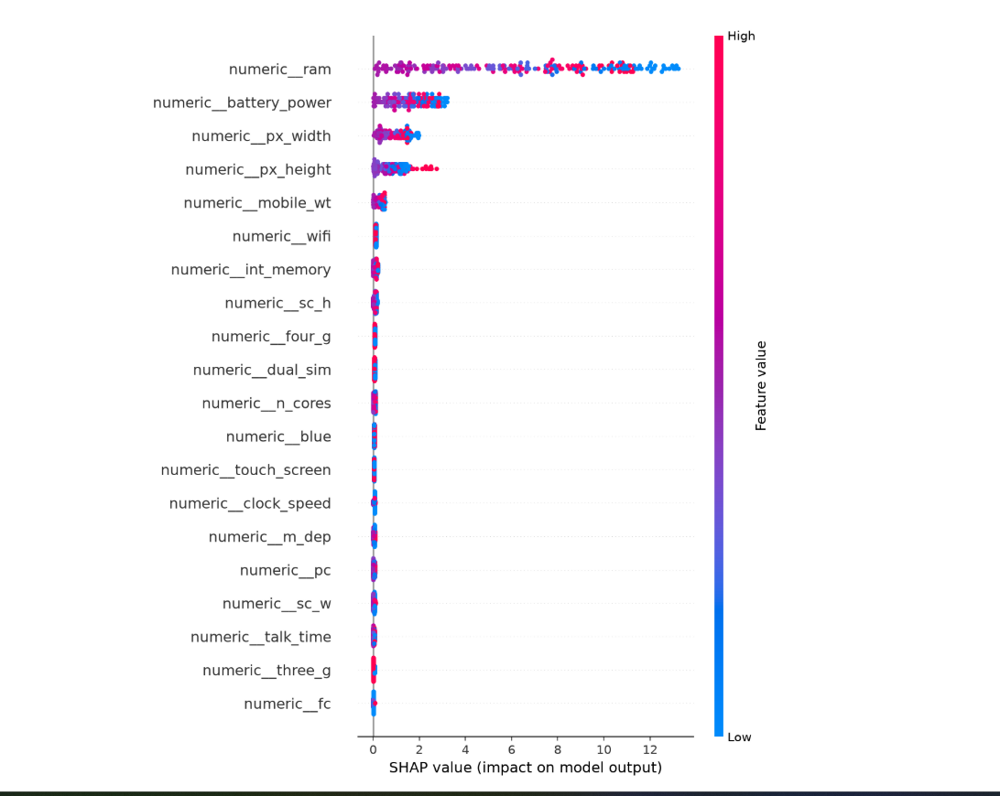

---

## Audit Report

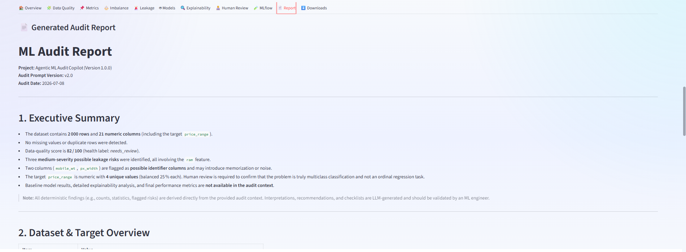

---
# Installation

## Clone Repository

```bash
git clone https://github.com/shivamrajput-ds/Agentic-ML-Audit-Copilot.git

cd Agentic-ML-Audit-Copilot
```

---

# Create Virtual Environment

Using **uv (Recommended)**

```bash
uv venv

uv sync
```

Using **Python**

```bash
python -m venv .venv
```

Windows

```bash
.venv\Scripts\activate
```

Linux / macOS

```bash
source .venv/bin/activate
```

Install dependencies

```bash
pip install -r requirements.txt
```

---

# Environment Variables

Create a `.env` file.

```text
GROQ_API_KEY=YOUR_GROQ_API_KEY
```

---

# Configuration

Project settings are managed inside

```text
config.yaml
```

You can customize

- Logging
- Upload limits
- Random seed
- MLflow
- Explainability
- API settings
- Report settings
- Preprocessing
- Metric defaults

---

# Running the Streamlit Dashboard

```bash
python -m streamlit run app/streamlit_app.py
```

Open

```
http://localhost:8501
```

---

# Running the FastAPI Server

```bash
uvicorn app.api:app --reload
```

Open Swagger

```
http://localhost:8000/docs
```

---

# Docker

Build

```bash
docker build -t agentic-ml-audit-copilot .
```

Run

```bash
docker run \
-p 8501:8501 \
-p 8000:8000 \
-e GROQ_API_KEY=YOUR_GROQ_API_KEY \
agentic-ml-audit-copilot
```

Open

```
Streamlit

http://localhost:8501

FastAPI

http://localhost:8000/docs
```

---

# Project Structure

```
Agentic-ML-Audit-Copilot
│
├── app
│   ├── api.py
│   └── streamlit_app.py
│
├── src
│   ├── audit
│   │   ├── profiler.py
│   │   ├── problem_detector.py
│   │   ├── data_quality.py
│   │   ├── leakage.py
│   │   ├── class_imbalance.py
│   │   ├── metric_recommender.py
│   │   ├── preprocessing.py
│   │   ├── baseline_models.py
│   │   ├── explainability.py
│   │   ├── mlflow_tracker.py
│   │   ├── llm_report.py
│   │   └── workflow.py
│   │
│   └── utils
│       ├── config.py
│       ├── exceptions.py
│       └── logger.py
│
├── assets
├── data
├── reports
├── tests
├── docs
├── config.yaml
├── requirements.txt
├── pyproject.toml
└── Dockerfile
```

---

# Testing

Run the complete test suite

```bash
python -m pytest -v
```

Current status

```
96 Tests Passed
```

Test screenshot

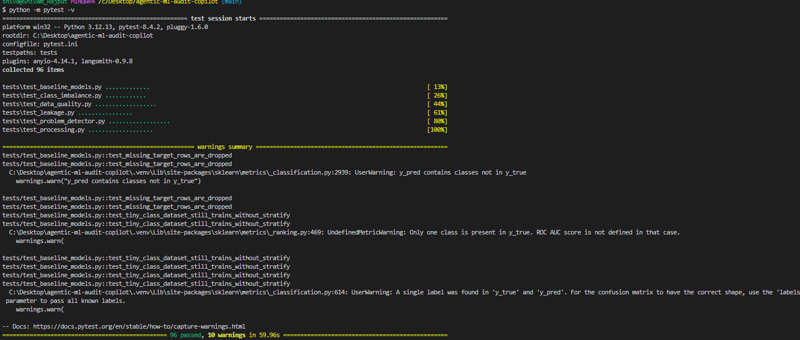

---

# Continuous Integration

Every push automatically runs

- Dependency installation
- Ruff checks
- Pytest

GitHub Actions

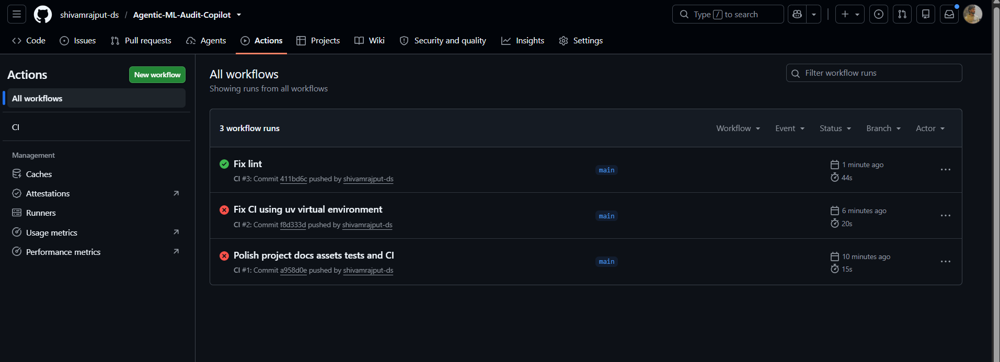

---

# API Endpoints

| Method | Endpoint | Description |
|----------|----------|-------------|
| GET | / | Root endpoint |
| GET | /health | Health check |
| POST | /audit | Complete audit |
| POST | /audit/summary | Lightweight audit |

Swagger

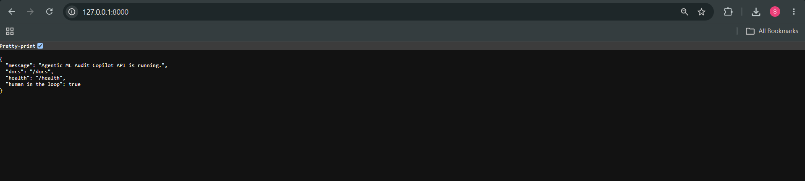

---

# Human Review Dashboard

The application surfaces high-risk findings that require manual attention before downstream modeling.

Examples include

- Possible target leakage
- Identifier columns
- High missing values
- High-cardinality features
- Severe class imbalance

The dashboard is designed to assist users during dataset validation rather than replacing human decision making.

---

# Generated Reports

The application generates

- Markdown Report
- JSON Report

Reports include

- Dataset Summary
- Quality Findings
- Leakage Risks
- Metric Recommendation
- Baseline Results
- Explainability
- Executive Summary

---

# Explainability

Supports

- SHAP values
- Feature importance
- Model interpretation

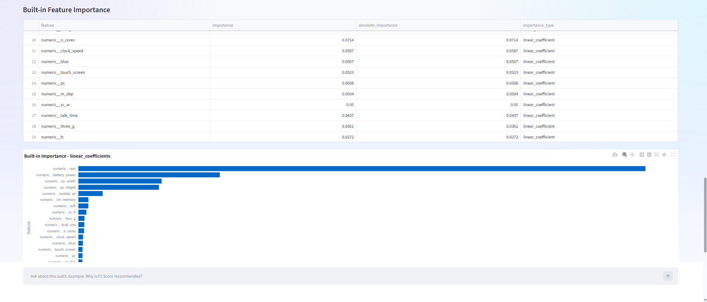

---

# MLflow Tracking

Every experiment automatically logs

- Parameters
- Metrics
- Models
- Artifacts

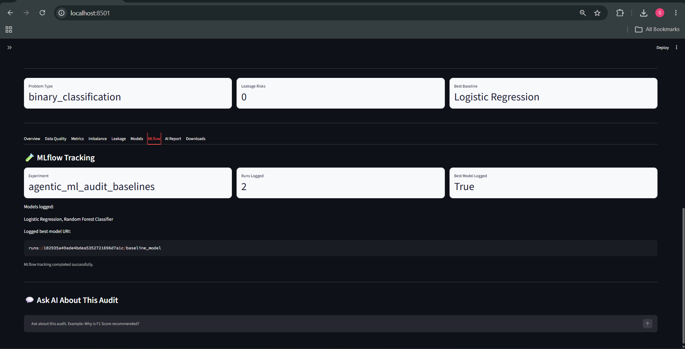

---

# Assets

The repository includes

- Architecture diagrams
- Workflow diagrams
- Dashboard screenshots
- API screenshots
- Project branding
- Demo assets

All images are located inside the `assets/` directory.
---

# Design Philosophy

This project follows a deterministic-first architecture.

Machine learning computations are intentionally separated from LLM capabilities.

Core ML tasks such as preprocessing, model training, metric computation, experiment tracking, and explainability are performed using Python and Scikit-learn.

The LLM is only responsible for generating natural language explanations and professional audit reports.

This separation improves reliability, reproducibility, and transparency.

---

# Engineering Decisions

Several design choices were intentionally made while building this project.

### Deterministic Pipeline

The audit workflow produces reproducible results for the same dataset.

---

### Modular Architecture

Each audit component is isolated into an independent module.

Examples include:

- Dataset Profiling
- Data Quality Audit
- Leakage Detection
- Class Imbalance Detection
- Metric Recommendation
- Preprocessing
- Baseline Training
- Explainability
- Report Generation

This makes the project easier to maintain, test, and extend.

---

### Configuration Driven

Most configurable parameters are stored in `config.yaml`.

Examples include:

- Missing value thresholds
- Leakage thresholds
- Random seed
- MLflow settings
- Explainability configuration
- Upload limits
- Logging

---

### Human Review Dashboard

Instead of making automatic business decisions, the application surfaces important findings that users should review before model training.

Examples include:

- Possible leakage
- Identifier columns
- High missing values
- Severe imbalance
- Constant features

---

# Current Limitations

The project currently focuses on tabular machine learning datasets.

Current limitations include:

- CSV datasets only
- Single-node execution
- Pandas-based processing
- Baseline models only
- No distributed computing
- No automated hyperparameter optimization
- No time-series specific leakage detection
- No data drift monitoring
- No model deployment pipeline

These limitations are intentional to keep the project focused on dataset auditing.

---

# Future Roadmap

Planned improvements include:

- Dask / Polars support for very large datasets
- Data Drift Detection
- SHAP dashboard improvements
- Automated Hyperparameter Optimization
- Time Series Audit Module
- Fairness & Bias Detection
- PDF Report Generation
- Cloud Storage Integration
- Multi-user Authentication
- Role-Based Access Control
- Kubernetes Deployment
- Experiment Comparison Dashboard

---

# Repository Statistics

| Component | Status |
|------------|---------|
| Dataset Profiling | ✅ |
| Data Quality Audit | ✅ |
| Leakage Detection | ✅ |
| Class Imbalance | ✅ |
| Metric Recommendation | ✅ |
| Preprocessing Pipeline | ✅ |
| Baseline Models | ✅ |
| MLflow Tracking | ✅ |
| SHAP Explainability | ✅ |
| FastAPI | ✅ |
| Streamlit Dashboard | ✅ |
| Docker Support | ✅ |
| GitHub Actions | ✅ |
| Automated Tests | ✅ |

---

# Why This Project?

Many machine learning projects focus only on model training.

This project focuses on what should happen **before** model training.

By auditing datasets first, users can identify common issues such as:

- Missing values
- Target leakage
- Identifier columns
- Class imbalance
- Poor evaluation metrics
- Weak preprocessing

This encourages more reliable and trustworthy machine learning workflows.

---

# Documentation

Additional documentation is available inside the `docs/` directory.

| Document | Description |
|-----------|-------------|
| ARCHITECTURE.md | System architecture |
| API.md | REST API documentation |
| USAGE.md | Usage guide |
| TESTING.md | Testing guide |
| ROADMAP.md | Future improvements |
| PROJECT_REVIEW.md | Technical review |
| KNOWN_LIMITATIONS.md | Current limitations |
| ASSETS.md | Branding and screenshots |

---

# Contributing

Contributions are welcome.

If you find a bug or have an improvement idea:

1. Fork the repository
2. Create a new branch
3. Make your changes
4. Run the test suite
5. Submit a Pull Request

Please read `CONTRIBUTING.md` before submitting changes.

---

# License

This project is licensed under the MIT License.

See the `LICENSE` file for details.

---

# Acknowledgements

This project uses several excellent open-source libraries.

- Scikit-learn
- Pandas
- NumPy
- FastAPI
- Streamlit
- LangGraph
- MLflow
- SHAP
- Groq
- Plotly

Special thanks to the open-source community for maintaining these tools.

---

# Author

**Shivam Rajput**

B.Tech Computer Science (AI & ML)

Focused on Machine Learning, Data Science, NLP, GenAI, and MLOps.

GitHub:

https://github.com/shivamrajput-ds

LinkedIn:

(Add your LinkedIn profile here)

Portfolio:

(Add your portfolio website here)

---

# Support

If you found this repository helpful, consider giving it a ⭐ on GitHub.

Feedback, suggestions, and contributions are always appreciated.

---

<p align="center">

Built with ❤️ using Python, Scikit-learn, LangGraph, FastAPI, Streamlit, MLflow, SHAP, and Groq.

</p>