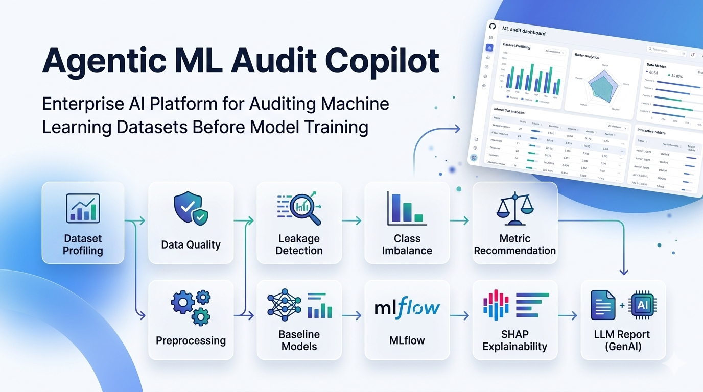
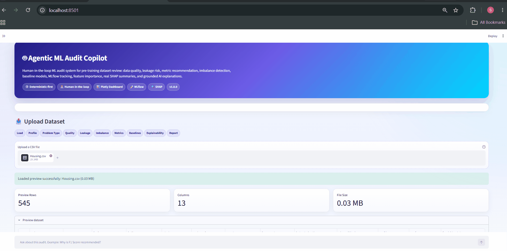

<!-- ========================================================= -->
<!--                  AGENTIC ML AUDIT COPILOT                 -->
<!-- ========================================================= -->

<p align="center">
  
</p>

<h1 align="center">Agentic ML Audit Copilot</h1>

<p align="center">
  A deterministic-first, human-in-the-loop ML audit platform for tabular datasets before model training.
</p>

<p align="center">
  <a href="https://youtu.be/kFzNam74QBc">Demo Video</a> •
  <a href="https://hub.docker.com/r/shivamrajput130/agentic-ml-audit-copilot">Docker Hub</a> •
  <a href="docs/ARCHITECTURE.md">Architecture</a> •
  <a href="docs/API.md">API Docs</a> •
  <a href="docs/DOCKER.md">Docker Guide</a>
</p>

<p align="center">
  
  
  
  
  
  
  
</p>

---

## Overview

Most machine learning projects start by directly training models.  
This project asks a better question first:

> **Is the dataset actually ready for machine learning?**

**Agentic ML Audit Copilot** audits tabular datasets before model training. It checks data quality, possible leakage risks, target imbalance, metric suitability, baseline model performance, explainability, and experiment tracking.

The system follows a **deterministic-first design**:

- Python performs all ML computation.
- Scikit-learn handles preprocessing and baseline modeling.
- MLflow tracks experiments.
- LangGraph orchestrates the workflow.
- The LLM is used only for explanations, audit Q&A, and report generation.
- Possible leakage is never treated as confirmed automatically; human review is required.

---

## Demo

### YouTube Walkthrough

https://youtu.be/kFzNam74QBc

### Quick Demo GIF

> Add your GIF here if available:

```md

```

---

## Key Features

| Area | Capability |
|---|---|
| Dataset Audit | Profiling, missing values, duplicates, constant columns, high-cardinality columns |
| Problem Detection | Binary classification, multiclass classification, regression |
| Leakage Review | Target-like names, duplicate target columns, correlation/proxy risk checks |
| Metrics | F1, ROC-AUC, PR-AUC, Balanced Accuracy, RMSE, MAE, R² |
| Modeling | Scikit-learn preprocessing pipelines and baseline models |
| Explainability | Built-in feature importance and SHAP summaries |
| Tracking | MLflow experiment tracking |
| Workflow | LangGraph orchestration |
| Interfaces | Streamlit dashboard and FastAPI backend |
| Deployment | Docker image published on Docker Hub |
| Quality | Ruff, pytest, GitHub Actions CI |

---

## Architecture

<p align="center">
  
</p>

```text
CSV Upload
   ↓
Dataset Profiling
   ↓
Problem Type Detection
   ↓
Data Quality Audit
   ↓
Possible Leakage Detection
   ↓
Class Imbalance Detection
   ↓
Metric Recommendation
   ↓
Preprocessing Pipeline
   ↓
Baseline Models
   ↓
MLflow Tracking
   ↓
Explainability
   ↓
LLM Audit Report
   ↓
Human Review Checklist
```

---

## Screenshots

### Streamlit Dashboard


### Data Quality Audit


### Possible Leakage Risks


### Baseline Models


### MLflow Tracking


### FastAPI Swagger UI


---

## Tech Stack

| Category | Tools |
|---|---|
| Language | Python |
| Data | Pandas, NumPy |
| ML | Scikit-learn |
| Workflow | LangGraph |
| Tracking | MLflow |
| Explainability | SHAP |
| API | FastAPI |
| Dashboard | Streamlit |
| LLM | Groq |
| Visualization | Plotly |
| Testing | Pytest |
| Linting | Ruff |
| Packaging | uv |
| Deployment | Docker |

---

## Quick Start

### 1. Clone Repository

```bash
git clone https://github.com/shivamrajput-ds/Agentic-ML-Audit-Copilot.git
cd Agentic-ML-Audit-Copilot
```

### 2. Create Environment

```bash
uv venv
```

Windows:

```bash
.venv\Scripts\activate
```

Linux/macOS:

```bash
source .venv/bin/activate
```

### 3. Install Dependencies

```bash
uv pip install -r requirements.txt
```

### 4. Configure Environment

Create a `.env` file:

```text
GROQ_API_KEY=your_groq_api_key
```

### 5. Run Streamlit

```bash
uv run streamlit run app/streamlit_app.py
```

Open:

```text
http://localhost:8501
```

### 6. Run FastAPI

```bash
uv run uvicorn app.api:app --reload
```

Open:

```text
http://localhost:8000/docs
```

---

## Docker

### Pull from Docker Hub

```bash
docker pull shivamrajput130/agentic-ml-audit-copilot:latest
```

### Run Container

```bash
docker run --rm \
  -p 8000:8000 \
  -p 8501:8501 \
  -e GROQ_API_KEY="your_groq_api_key" \
  shivamrajput130/agentic-ml-audit-copilot:latest
```

Open:

```text
Streamlit Dashboard: http://localhost:8501
FastAPI Docs:       http://localhost:8000/docs
Health Check:       http://localhost:8000/health
```

### Build Locally

```bash
docker build -t agentic-ml-audit-copilot .
```

```bash
docker run --rm \
  -p 8000:8000 \
  -p 8501:8501 \
  -e GROQ_API_KEY="your_groq_api_key" \
  agentic-ml-audit-copilot
```

---

## API Endpoints

| Method | Endpoint | Description |
|---|---|---|
| GET | `/` | API information |
| GET | `/health` | Health check |
| POST | `/audit` | Run complete audit |
| POST | `/audit/summary` | Return lightweight audit summary |

Swagger UI:

```text
http://localhost:8000/docs
```

---

## MLflow

Run MLflow UI locally:

```bash
uv run mlflow ui --host 127.0.0.1 --port 5000
```

Open:

```text
http://127.0.0.1:5000
```

MLflow tracks:

- Baseline model runs
- Metrics
- Parameters
- Best model
- Optional model artifacts

---

## Testing and Code Quality

Run tests:

```bash
uv run pytest
```

Run Ruff:

```bash
uv run ruff check .
```

Format code:

```bash
uv run ruff format .
```

Current status:

```text
96 tests passed
Ruff linting passed
Docker image published
GitHub Actions CI configured
```

---

## Project Structure

```text
Agentic-ML-Audit-Copilot/
│
├── app/
│   ├── api.py
│   └── streamlit_app.py
│
├── src/
│   ├── audit/
│   │   ├── profiler.py
│   │   ├── problem_detector.py
│   │   ├── data_quality.py
│   │   ├── leakage.py
│   │   ├── class_imbalance.py
│   │   ├── metric_recommender.py
│   │   ├── preprocessing.py
│   │   ├── baseline_models.py
│   │   ├── explainability.py
│   │   ├── mlflow_tracker.py
│   │   ├── llm_report.py
│   │   └── workflow.py
│   │
│   └── utils/
│       ├── config.py
│       ├── exceptions.py
│       └── logger.py
│
├── tests/
├── docs/
├── assets/
├── config.yaml
├── requirements.txt
├── pyproject.toml
├── Dockerfile
├── start.sh
└── README.md
```

---

## Documentation

Detailed documentation is available in the `docs/` folder.

| Document | Description |
|---|---|
| [ARCHITECTURE.md](docs/ARCHITECTURE.md) | System architecture |
| [API.md](docs/API.md) | FastAPI documentation |
| [DOCKER.md](docs/DOCKER.md) | Docker build/run/push guide |
| [USAGE.md](docs/USAGE.md) | Local usage guide |
| [TESTING.md](docs/TESTING.md) | Testing guide |
| [ROADMAP.md](docs/ROADMAP.md) | Future roadmap |
| [PROJECT_REVIEW.md](docs/PROJECT_REVIEW.md) | Technical project review |
| [KNOWN_LIMITATIONS.md](docs/KNOWN_LIMITATIONS.md) | Current limitations |
| [ASSETS.md](docs/ASSETS.md) | Assets guide |

---

## Current Limitations

The current version focuses on:

- CSV datasets
- Tabular ML
- Classification and regression
- Single-machine execution
- Baseline modeling

Not currently included:

- Distributed processing
- Authentication
- Multi-user workspaces
- Time-series auditing
- Data drift monitoring
- Kubernetes deployment

See [KNOWN_LIMITATIONS.md](docs/KNOWN_LIMITATIONS.md) for details.

---

## Roadmap

Planned improvements:

- Data Drift Detection
- Feature Drift Detection
- Fairness & Bias Analysis
- Hyperparameter Optimization
- Excel and Parquet Support
- Polars and Dask Support
- PDF and HTML Reports
- Authentication
- Team Workspaces
- Kubernetes Deployment

See [ROADMAP.md](docs/ROADMAP.md) for the complete roadmap.

---

## Design Philosophy

This project is built around five principles:

1. **Deterministic-first ML**
2. **Human-in-the-loop review**
3. **Reusable sklearn pipelines**
4. **Experiment reproducibility with MLflow**
5. **LLM explanations without LLM-based ML computation**

The goal is not just to train models, but to understand whether the dataset is ready for reliable modeling.

---

## Contributing

Contributions are welcome.

Before opening a pull request:

```bash
uv run ruff format .
uv run ruff check .
uv run pytest
```

Please read [CONTRIBUTING.md](CONTRIBUTING.md).

---

## License

This project is licensed under the MIT License.

See [LICENSE.md](LICENSE.md).

---

## Author

**Shivam Rajput**

- GitHub: https://github.com/shivamrajput-ds
- Portfolio: https://shivamrajput-ds.github.io/portfolio-website/
- LinkedIn: https://www.linkedin.com/in/shivam-rajput-ds/
- Docker Hub: https://hub.docker.com/r/shivamrajput130/agentic-ml-audit-copilot
- YouTube Demo: https://youtu.be/kFzNam74QBc
- Kaggle: https://www.kaggle.com/shivamja
- LeetCode: https://leetcode.com/u/ShivamSynapse/

---

<p align="center">
If this project helped you, consider giving the repository a star.
</p>

<p align="center">
Built with Python, Scikit-learn, LangGraph, FastAPI, Streamlit, MLflow, SHAP, Docker, and Groq.
</p>
