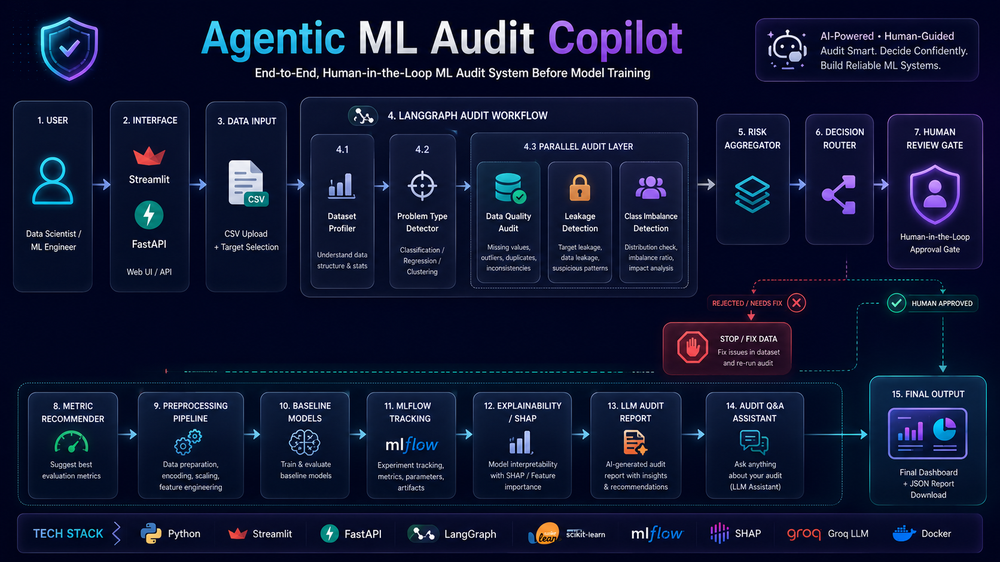
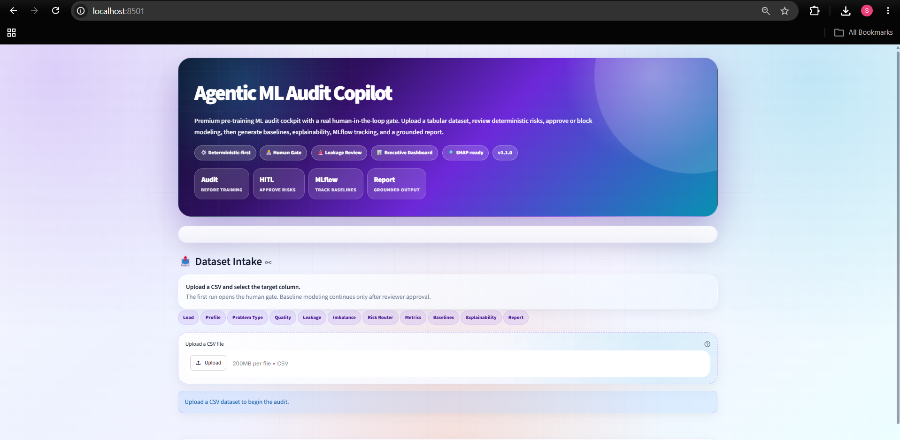
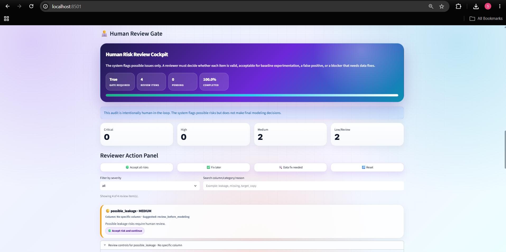
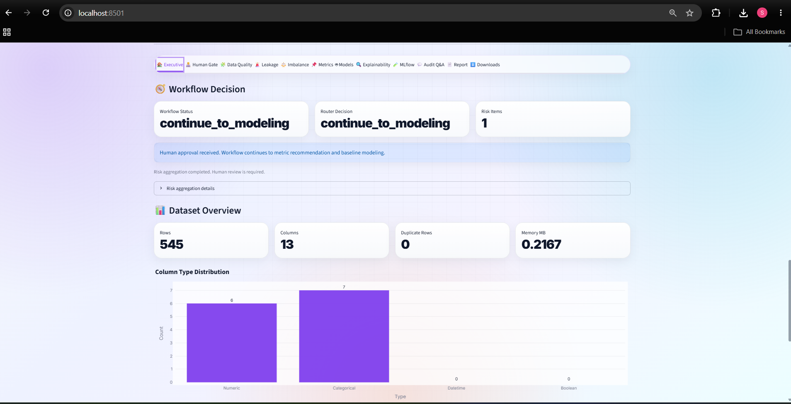

<p align="center">
  
</p>

<h1 align="center">Agentic ML Audit Copilot</h1>

<p align="center">
  <b>Human-in-the-loop ML audit system before model training</b>
</p>

<p align="center">
  A deterministic-first ML engineering project that audits tabular datasets before model development,
  surfaces data risks, pauses risky workflows for human review, benchmarks baseline models,
  tracks experiments, explains results, and generates audit reports.
</p>

<p align="center">
  
  
  
  
  
  
  
  
  
  
</p>

<p align="center">
  <a href="https://shivamrajput-ds-agentic-ml-audit-copilo-appstreamlit-app-joxap5.streamlit.app">
    
  </a>
  <a href="https://youtu.be/kFzNam74QBc">
    
  </a>
  <a href="https://hub.docker.com/r/shivamrajput130/agentic-ml-audit-copilot">
    
  </a>
</p>

---

## Overview

Most ML projects start by training models too early.

In real projects, poor data quality, possible target leakage, class imbalance, and wrong metrics can make a model look better than it actually is.

**Agentic ML Audit Copilot** solves this by reviewing a dataset before model training. It behaves like a junior ML reviewer: it runs deterministic audit checks, explains the risk, and asks for human approval when the dataset is not clearly safe.

This is not an AutoML tool. The goal is not to train the best possible model. The goal is to decide whether the dataset is ready for responsible baseline modeling.

---

## What It Checks

| Area | What the system does |
| --- | --- |
| Dataset Profiling | Rows, columns, data types, missing values, target summary |
| Problem Detection | Detects classification or regression setup |
| Data Quality | Finds missing values, duplicates, constant columns, ID-like columns, and outliers |
| Leakage Risk | Flags target-like columns, proxy features, and suspicious correlations |
| Class Imbalance | Measures class distribution and severity |
| Metric Recommendation | Suggests suitable metrics for the detected problem type |
| Preprocessing | Builds scikit-learn preprocessing pipelines |
| Baseline Models | Trains simple baseline models for comparison |
| MLflow | Tracks experiment metadata and model metrics |
| Explainability | Generates feature importance and SHAP-based summaries |
| Human Review | Pauses risky workflows for reviewer decisions |
| Reports | Exports Markdown and JSON audit reports |
| API | Provides FastAPI endpoints for programmatic audit access |
| UI | Provides a Streamlit dashboard for interactive review |

---

## Key Ideas

- **Deterministic-first:** Python performs the audit checks and ML computation.
- **Human-in-the-loop:** Risky datasets require reviewer approval before modeling continues.
- **LLM is not the judge:** The LLM is used only for explanation, Q&A, and report writing.
- **Baseline-first:** The system trains simple baselines instead of pretending to be AutoML.
- **Transparent workflow:** Every major decision is visible in the dashboard and API response.

---

## Demo

### Live Application

```text
https://shivamrajput-ds-agentic-ml-audit-copilo-appstreamlit-app-joxap5.streamlit.app/
```

### YouTube Walkthrough

```text
https://youtu.be/kFzNam74QBc
```

### Demo Preview

<p align="center">
  
</p>

---

## System Architecture

<p align="center">
  
</p>

The architecture separates the UI, API, LangGraph workflow, audit modules, risk routing, human review, modeling, tracking, explainability, and reporting layers.

---

## Human-in-the-Loop Workflow

<p align="center">
  
</p>

The workflow pauses at the Human Review Gate when important risks are found.

Reviewer decisions include:

- Accept risk and continue
- Accept flag and fix later
- Mark false positive
- Needs data fix
- Reject modeling

If the final human decision approves modeling, the workflow continues to metric recommendation, preprocessing, baseline models, MLflow, SHAP, and final report generation.

If rejected, the workflow stops so the dataset can be fixed first.

---

## FastAPI Workflow

<p align="center">
  
</p>

The API supports both direct audit runs and a human-review-first workflow.

---

## Dashboard Screenshots

### Streamlit Home

<p align="center">
  
</p>

### Human Review Gate

<p align="center">
  
</p>

### Executive Dashboard

<p align="center">
  
</p>

### FastAPI Docs

<p align="center">
  
</p>

---

## Workflow

```text
User
  |
  v
Streamlit UI / FastAPI API
  |
  v
CSV Upload + Target Selection
  |
  v
LangGraph Audit Workflow
  |
  v
Dataset Profiler
  |
  v
Problem Type Detector
  |
  v
Parallel Audit Layer
  |-- Data Quality Audit
  |-- Leakage Detection
  |-- Class Imbalance Detection
  |
  v
Risk Aggregator
  |
  v
Decision Router
  |
  v
Human Review Gate
  |-- Stop / Fix Data
  |-- Human Approved
          |
          v
      Metric Recommender
          |
          v
      Preprocessing Pipeline
          |
          v
      Baseline Models
          |
          v
      MLflow Tracking
          |
          v
      Explainability / SHAP
          |
          v
      LLM Audit Report
          |
          v
      Audit Q&A
          |
          v
      Final Dashboard + JSON Report
```

---

## Technology Stack

| Layer | Tools |
| --- | --- |
| Language | Python |
| Data Processing | Pandas, NumPy |
| Machine Learning | scikit-learn |
| Workflow Orchestration | LangGraph |
| API | FastAPI |
| Dashboard | Streamlit |
| Experiment Tracking | MLflow |
| Explainability | SHAP |
| LLM Provider | Groq |
| Visualization | Plotly |
| Testing | pytest |
| Linting and Formatting | Ruff |
| Packaging | uv |
| Deployment | Docker |

---

## Quick Start

### 1. Clone the repository

```bash
git clone https://github.com/shivamrajput-ds/Agentic-ML-Audit-Copilot.git
cd Agentic-ML-Audit-Copilot
```

### 2. Create a virtual environment

```bash
uv venv
```

Windows:

```bash
.venv\Scripts\activate
```

Linux/macOS:

```bash
source .venv/bin/activate
```

### 3. Install dependencies

```bash
uv pip install -r requirements.txt
uv pip install -e .
```

### 4. Configure environment variables

Create a `.env` file:

```text
GROQ_API_KEY=your_groq_api_key
```

For deterministic audit-only usage, the LLM can be disabled if supported by your config:

```bash
export LLM_ENABLED=false
```

Windows PowerShell:

```powershell
$env:LLM_ENABLED="false"
```

### 5. Run Streamlit

```bash
uv run streamlit run app/streamlit_app.py --server.port 8501
```

Open:

```text
http://localhost:8501
```

### 6. Run FastAPI

Use a second terminal:

```bash
uv run uvicorn app.api:app --reload --host 127.0.0.1 --port 8000
```

Open:

```text
http://127.0.0.1:8000/docs
```

---

## API Endpoints

### System

| Method | Endpoint | Description |
| --- | --- | --- |
| GET | `/` | API information |
| GET | `/health` | Health check |
| GET | `/metadata` | Project and runtime metadata |
| GET | `/workflow-guide` | Human review workflow guide |

### Audit

| Method | Endpoint | Description |
| --- | --- | --- |
| POST | `/audit` | Run audit workflow |
| POST | `/audit/summary` | Run audit and return lightweight summary |
| GET | `/audit/modes` | Show available audit modes |

### Human Review

| Method | Endpoint | Description |
| --- | --- | --- |
| POST | `/audit/review-gate` | Run audit until human review gate |
| GET | `/human-review/decision-template` | Return reviewer decision JSON template |
| POST | `/audit/after-human-approval` | Continue workflow after reviewer approval |

### Human Review API Flow

```text
1. POST /audit/review-gate
2. Review human_review.review_items
3. GET /human-review/decision-template
4. Fill reviewer decision JSON
5. POST /audit/after-human-approval
6. Continue to baselines, MLflow, SHAP, and final report
```

---

## MLflow Tracking

The project logs baseline experiment information with MLflow.

Typical tracked information includes:

- Problem type
- Baseline model names
- Evaluation metrics
- Best baseline model
- Parameters
- Runtime metadata

Run MLflow UI locally:

```bash
uv run mlflow ui
```

Open:

```text
http://localhost:5000
```

---

## Testing

Run the full test suite:

```bash
uv run pytest -q
```

Run a specific test file:

```bash
uv run pytest tests/test_data_quality.py -q
```

---

## Code Quality

Run Ruff checks:

```bash
uv run ruff check . --fix --unsafe-fixes
```

Format the project:

```bash
uv run ruff format .
```

---

## Docker

Pull the image:

```bash
docker pull shivamrajput130/agentic-ml-audit-copilot:latest
```

Run the container:

```bash
docker run --rm \
  -p 8501:8501 \
  -p 8000:8000 \
  -e GROQ_API_KEY="your_groq_api_key" \
  shivamrajput130/agentic-ml-audit-copilot:latest
```

Build locally:

```bash
docker build -t agentic-ml-audit-copilot .
```

Run local image:

```bash
docker run --rm \
  -p 8501:8501 \
  -p 8000:8000 \
  -e GROQ_API_KEY="your_groq_api_key" \
  agentic-ml-audit-copilot
```

---

## Project Structure

```text
Agentic-ML-Audit-Copilot/
├── app/
│   ├── api.py
│   └── streamlit_app.py
├── src/
│   ├── audit/
│   └── utils/
├── tests/
├── docs/
├── assets/
│   ├── architecture/
│   ├── branding/
│   ├── demo/
│   └── screenshots/
├── data/
├── reports/
├── artifacts/
├── logs/
├── .github/
├── .streamlit/
├── config.yaml
├── pyproject.toml
├── requirements.txt
├── uv.lock
├── pytest.ini
├── Dockerfile
├── DOCKER.md
├── README.md
├── CHANGELOG.md
├── CONTRIBUTING.md
├── CODE_OF_CONDUCT.md
├── SECURITY.md
└── LICENSE.md
```

---

## Documentation

| Document | Purpose |
| --- | --- |
| `docs/ARCHITECTURE.md` | System architecture and workflow design |
| `docs/API.md` | FastAPI endpoint guide |
| `docs/USAGE.md` | How to use the Streamlit app and API |
| `DOCKER.md` | Docker build and run guide |
| `CHANGELOG.md` | Release history |
| `CONTRIBUTING.md` | Contribution guidelines |
| `CODE_OF_CONDUCT.md` | Community rules |
| `SECURITY.md` | Security policy |
| `LICENSE.md` | License details |

---

## Engineering Highlights

- LangGraph-based audit workflow
- Parallel deterministic audit checks
- Human Review Gate for risky datasets
- FastAPI backend with Swagger documentation
- Streamlit dashboard with audit tabs and downloads
- MLflow experiment tracking
- SHAP and feature importance support
- JSON-safe API responses
- Configuration-driven behavior
- Centralized logging and exception handling
- pytest test suite
- Ruff linting and formatting
- Dockerized local deployment
- GitHub Actions CI support

---

## Current Limitations

This project currently focuses on:

- CSV datasets
- Tabular ML
- Classification and regression
- Single-machine execution
- Baseline model benchmarking

It is not a replacement for:

- Full enterprise data governance
- Security review
- Production monitoring
- Fairness certification
- Model approval boards

---

## Roadmap

Planned improvements:

- Data drift detection
- Feature drift detection
- Fairness and bias analysis
- Hyperparameter optimization
- PDF reports
- HTML reports
- Polars support
- Dask support
- Authentication
- Team workspaces
- Kubernetes deployment
- Cloud deployment templates

---

## Contributing

Contributions are welcome.

Before opening a pull request:

```bash
uv run ruff check . --fix --unsafe-fixes
uv run ruff format .
uv run pytest -q
```

Please read:

```text
CONTRIBUTING.md
CODE_OF_CONDUCT.md
```

---

## License

This project is released under the MIT License.

See:

```text
LICENSE.md
```

---

## Author

**Shivam Rajput**

Data Science | Machine Learning | MLOps | Agentic AI

- Portfolio: `https://shivamrajput-ds.github.io/portfolio-website/`
- GitHub: `https://github.com/shivamrajput-ds`
- LinkedIn: `https://www.linkedin.com/in/shivam-rajput-ds/`
- Docker Hub: `https://hub.docker.com/r/shivamrajput130/agentic-ml-audit-copilot`
- YouTube: `https://youtu.be/kFzNam74QBc`
- Kaggle: `https://www.kaggle.com/shivamja`
- LeetCode: `https://leetcode.com/u/ShivamSynapse/`
- X: `https://x.com/ShivamR65014299`

---

<p align="center">
  <b>Agentic ML Audit Copilot</b>
</p>

<p align="center">
  Python • scikit-learn • FastAPI • Streamlit • LangGraph • MLflow • SHAP • Docker • Groq
</p>
