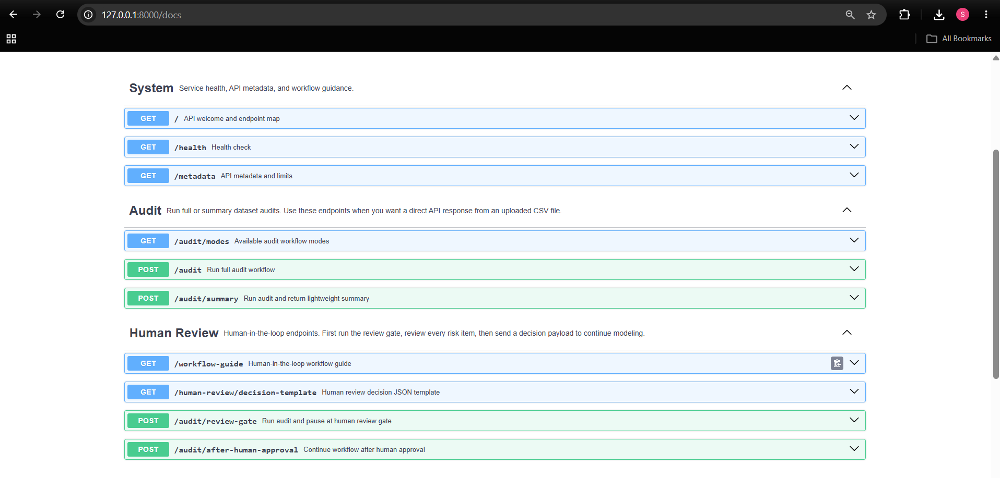

# API Documentation

## Overview

**Agentic ML Audit Copilot** exposes a REST API built with **FastAPI**.

The API allows clients to upload tabular datasets, run deterministic audit checks, review dataset risks, continue modeling after human approval, and retrieve structured audit results.

Interactive documentation is available through Swagger UI and ReDoc.

---

## Base URL

Local development:

```text
http://127.0.0.1:8000
```

Swagger UI:

```text
http://127.0.0.1:8000/docs
```

ReDoc:

```text
http://127.0.0.1:8000/redoc
```

Health check:

```text
http://127.0.0.1:8000/health
```

---

## Authentication

Current version:

- No authentication required

Planned future support:

- API keys
- JWT authentication
- OAuth2
- Role-based access control

For local portfolio and demo usage, the API can be run without authentication. Production deployments should add authentication, rate limiting, and secure secret management.

---

## Supported Dataset Format

Currently supported:

```text
.csv
```

Future support may include:

- Excel
- Parquet
- JSON

Maximum upload size is configurable through:

```text
config.yaml
```

---

## Endpoint Summary

### System Endpoints

| Method | Endpoint | Description |
| --- | --- | --- |
| GET | `/` | API information |
| GET | `/health` | Service health check |
| GET | `/metadata` | Project and runtime metadata |
| GET | `/workflow-guide` | Human review workflow guide |

### Audit Endpoints

| Method | Endpoint | Description |
| --- | --- | --- |
| POST | `/audit` | Run audit workflow |
| POST | `/audit/summary` | Run audit and return lightweight summary |
| GET | `/audit/modes` | Show available audit modes |

### Human Review Endpoints

| Method | Endpoint | Description |
| --- | --- | --- |
| POST | `/audit/review-gate` | Run audit until Human Review Gate |
| GET | `/human-review/decision-template` | Return reviewer decision JSON template |
| POST | `/audit/after-human-approval` | Continue workflow after reviewer approval |

---

## GET /

Returns basic API information.

### Request

```http
GET /
```

### Example Response

```json
{
  "message": "Agentic ML Audit Copilot API is running.",
  "version": "1.1.0",
  "docs": "/docs",
  "health": "/health",
  "human_in_the_loop": true
}
```

---

## GET /health

Returns service health status.

### Request

```http
GET /health
```

### Example Response

```json
{
  "status": "healthy",
  "service": "agentic-ml-audit-copilot",
  "version": "1.1.0"
}
```

---

## GET /metadata

Returns project and runtime metadata.

### Request

```http
GET /metadata
```

### Example Response

```json
{
  "project": "Agentic ML Audit Copilot",
  "version": "1.1.0",
  "workflow": "deterministic-first",
  "human_review_enabled": true,
  "supported_file_types": [".csv"],
  "ui": "Streamlit",
  "api": "FastAPI"
}
```

---

## GET /workflow-guide

Returns a guide explaining the audit and human review workflow.

### Request

```http
GET /workflow-guide
```

### Example Response

```json
{
  "workflow": [
    "Upload dataset",
    "Run deterministic audit checks",
    "Aggregate risks",
    "Pause at Human Review Gate if needed",
    "Continue after reviewer approval",
    "Run baseline models, MLflow, SHAP, and final report"
  ],
  "human_review_decisions": [
    "accept_risk_and_continue",
    "accept_flag_fix_later",
    "mark_false_positive",
    "needs_data_fix",
    "reject_modeling"
  ]
}
```

---

## GET /audit/modes

Returns available audit execution modes.

### Request

```http
GET /audit/modes
```

### Example Response

```json
{
  "modes": [
    {
      "name": "standard",
      "description": "Run audit workflow with automatic routing."
    },
    {
      "name": "review_gate",
      "description": "Run audit until the Human Review Gate."
    },
    {
      "name": "human_approved",
      "description": "Continue modeling after human approval."
    }
  ]
}
```

---

## POST /audit

Runs the audit workflow.

This endpoint is useful for direct API usage. If the dataset contains serious risks, the response may show that the workflow paused for human review.

### Request

Content type:

```text
multipart/form-data
```

Parameters:

| Field | Type | Required | Description |
| --- | --- | :---: | --- |
| file | CSV file | Yes | Dataset to audit |
| target_column | String | Yes | Target column name |
| workflow_mode | String | No | Optional workflow mode |
| human_review_decision_json | String | Required only for approved continuation mode | Reviewer decision payload as JSON string |

### Basic Example

```bash
curl -X POST "http://127.0.0.1:8000/audit" \
  -F "file=@data/sample/student_mark.csv" \
  -F "target_column=Grade"
```

### Example Response

```json
{
  "message": "Audit completed successfully.",
  "workflow_status": "completed",
  "problem_type": "classification",
  "audit_score": 82.5,
  "human_review_required": false,
  "best_model": "Logistic Regression"
}
```

### Possible Human Review Response

```json
{
  "message": "Audit paused for human review.",
  "workflow_status": "paused_for_human_review",
  "human_review_required": true,
  "human_review": {
    "review_items": [
      {
        "id": "leakage_001",
        "risk_type": "possible_leakage",
        "risk_level": "high",
        "column": "Total",
        "reason": "Column name appears target-like or outcome-related."
      }
    ]
  }
}
```

---

## POST /audit/summary

Runs the audit workflow and returns a lightweight summary.

This endpoint is useful for dashboards or integrations that do not need the complete audit payload.

### Request

```bash
curl -X POST "http://127.0.0.1:8000/audit/summary" \
  -F "file=@data/sample/student_mark.csv" \
  -F "target_column=Grade"
```

### Example Response

```json
{
  "workflow_status": "completed",
  "problem_type": "classification",
  "audit_score": 82.5,
  "human_review_required": false,
  "best_model": "Logistic Regression",
  "risk_summary": {
    "risk_level": "medium",
    "total_risks": 3
  }
}
```

---

## POST /audit/review-gate

Runs the deterministic audit checks and stops at the Human Review Gate.

Use this endpoint when you want explicit reviewer approval before metric recommendation, preprocessing, baseline models, MLflow, SHAP, and final report generation.

### Request

```bash
curl -X POST "http://127.0.0.1:8000/audit/review-gate" \
  -F "file=@data/sample/student_mark.csv" \
  -F "target_column=Grade"
```

### Example Response

```json
{
  "message": "Human review gate completed.",
  "workflow_status": "paused_for_human_review",
  "target_column": "Grade",
  "problem_type": "classification",
  "human_review": {
    "required": true,
    "review_items": [
      {
        "id": "risk_001",
        "risk_type": "possible_leakage",
        "risk_level": "high",
        "column": "Total",
        "reason": "Column may contain information derived from the target."
      }
    ],
    "allowed_decisions": [
      "accept_risk_and_continue",
      "accept_flag_fix_later",
      "mark_false_positive",
      "needs_data_fix",
      "reject_modeling"
    ]
  }
}
```

---

## GET /human-review/decision-template

Returns a JSON template that can be filled by the reviewer.

### Request

```http
GET /human-review/decision-template
```

### Example Response

```json
{
  "final_decision": "approved",
  "reviewer": "your-name",
  "notes": "Reviewed possible risks and approved baseline modeling.",
  "decisions": [
    {
      "risk_id": "risk_001",
      "decision": "accept_risk_and_continue",
      "comment": "Risk accepted for baseline experiment."
    }
  ]
}
```

### Allowed Final Decisions

```text
approved
rejected
needs_fix
```

### Allowed Item Decisions

```text
accept_risk_and_continue
accept_flag_fix_later
mark_false_positive
needs_data_fix
reject_modeling
```

---

## POST /audit/after-human-approval

Continues the workflow after reviewer approval.

This endpoint expects the same dataset, same target column, and a reviewer decision JSON payload.

### Request

```bash
curl -X POST "http://127.0.0.1:8000/audit/after-human-approval" \
  -F "file=@data/sample/student_mark.csv" \
  -F "target_column=Grade" \
  -F 'human_review_decision_json={
    "final_decision": "approved",
    "reviewer": "Shivam",
    "notes": "Reviewed and approved for baseline modeling.",
    "decisions": [
      {
        "risk_id": "risk_001",
        "decision": "accept_risk_and_continue",
        "comment": "Accepted for demo baseline run."
      }
    ]
  }'
```

### Example Response

```json
{
  "message": "Audit completed after human approval.",
  "workflow_status": "completed",
  "human_review": {
    "final_decision": "approved"
  },
  "problem_type": "classification",
  "metric_recommendation": {
    "primary_metric": "macro_f1"
  },
  "best_model": "Logistic Regression",
  "mlflow": {
    "enabled": true,
    "status": "logged"
  },
  "explainability": {
    "status": "completed"
  },
  "report": {
    "format": ["markdown", "json"]
  }
}
```

If the final human decision is rejected or needs a data fix, the workflow should stop before modeling.

---

## Recommended HITL API Flow

```text
1. POST /audit/review-gate
2. Inspect human_review.review_items
3. GET /human-review/decision-template
4. Fill reviewer decision JSON
5. POST /audit/after-human-approval
6. Continue to metric recommendation, baseline models, MLflow, SHAP, and final report
```

This flow is recommended for production-like review behavior because it makes the human decision explicit.

---

## Response Structure

A full audit response may include:

```text
profile
problem_type
data_quality
leakage
class_imbalance
risk_summary
workflow_decision
human_review
metric_recommendation
preprocessing
baseline_models
mlflow
explainability
report
downloads
```

Exact fields may vary depending on:

- Problem type
- Workflow mode
- Whether human review is required
- Whether modeling was approved
- Whether optional explainability and LLM reporting are enabled

---

## HTTP Status Codes

| Status | Meaning |
| --- | --- |
| 200 | Request completed successfully |
| 400 | Invalid request or invalid audit input |
| 413 | Uploaded file exceeds configured size |
| 422 | Request validation error |
| 500 | Internal server error |

---

## Common Error Responses

### Missing Target Column

```json
{
  "detail": "Target column is required."
}
```

### Target Column Not Found

```json
{
  "detail": "Target column 'price' was not found in the uploaded dataset."
}
```

### Unsupported File Type

```json
{
  "detail": "Unsupported file type. Please upload a CSV file."
}
```

### File Too Large

```json
{
  "detail": "Uploaded file exceeds the configured size limit."
}
```

### Invalid Human Review Decision

```json
{
  "detail": "Invalid human review decision payload."
}
```

### Internal Server Error

```json
{
  "detail": "Unexpected server error during audit execution."
}
```

---

## Swagger UI

FastAPI automatically generates interactive API documentation.

Open:

```text
http://127.0.0.1:8000/docs
```

Swagger UI supports:

- Endpoint testing
- Request validation
- Response schema preview
- File upload testing
- Human review endpoint testing

<p align="center">
  
</p>

---

## Performance Notes

The current API is designed for local and demo-scale tabular datasets.

Performance depends on:

- Dataset size
- Number of columns
- Number of categorical levels
- Baseline model training time
- SHAP computation
- LLM report generation if enabled

Current design:

- CSV input
- Synchronous request-response execution
- Threadpool execution where useful
- Configurable upload limits
- Deterministic workflow stages

Future versions may add background jobs and progress tracking.

---

## Security Notes

Current safety measures include:

- File type validation
- Upload size limits
- Safe filename handling
- Environment-variable-based secrets
- JSON-safe response formatting
- Structured error handling

Production deployments should add:

- Authentication
- Authorization
- Rate limiting
- Request logging
- Secure secret management
- Monitoring and alerting
- Network-level controls

---

## API Design Principles

The API follows the same design principles as the main project:

- Python performs deterministic audit checks.
- The LLM is used only for explanation, Q&A, and report writing.
- Possible leakage is treated as a risk, not as confirmed leakage.
- Human review is required for risky datasets.
- API responses should be clear, structured, and JSON-safe.
- Modeling should not continue after rejected human review decisions.

---

## Future API Enhancements

Planned improvements:

- Authentication
- Rate limiting
- Async background jobs
- Progress tracking
- Batch audit endpoint
- Dataset versioning
- Cloud storage integration
- WebSocket updates
- API key management
- Team and workspace support

---

## Summary

The FastAPI service exposes the audit workflow through a clear set of system, audit, and human review endpoints.

It supports both simple audit usage and a more controlled human-in-the-loop workflow where risky datasets are reviewed before baseline modeling, MLflow tracking, SHAP explainability, and report generation.
