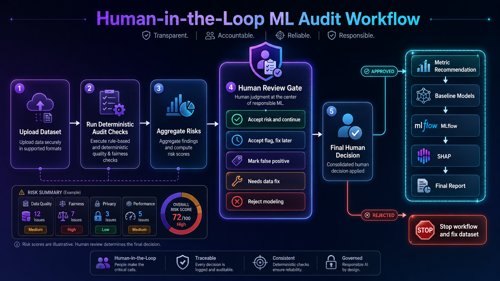
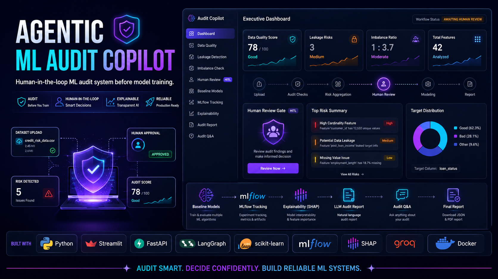

# System Architecture

## Overview

**Agentic ML Audit Copilot** is a modular ML audit system for reviewing tabular datasets before model training.

The project is designed to answer one practical question:

> Is this dataset ready for responsible baseline modeling?

Instead of directly training optimized models, the system first checks data quality, possible leakage risks, class imbalance, metric suitability, and workflow readiness. If important risks are found, the workflow can pause at a Human Review Gate before modeling continues.

The project follows a deterministic-first design:

- Python performs audit checks and ML computation.
- Scikit-learn handles preprocessing and baseline models.
- LangGraph orchestrates the audit workflow.
- MLflow tracks experiment metadata and metrics.
- SHAP and built-in feature importance explain baseline behavior.
- The LLM is used only for explanations, audit Q&A, and report writing.

---

## Architecture Diagram

<p align="center">
  
</p>

---

## High-Level Architecture

```text
User
  |
  v
Streamlit UI / FastAPI API
  |
  v
CSV Upload + Target Selection
  |
  v
LangGraph Audit Workflow
  |
  v
Dataset Profiler
  |
  v
Problem Type Detector
  |
  v
Parallel Audit Layer
  |-- Data Quality Audit
  |-- Leakage Detection
  |-- Class Imbalance Detection
  |
  v
Risk Aggregator
  |
  v
Decision Router
  |
  v
Human Review Gate
  |-- Stop / Fix Dataset
  |-- Human Approved
          |
          v
      Metric Recommender
          |
          v
      Preprocessing Pipeline
          |
          v
      Baseline Models
          |
          v
      MLflow Tracking
          |
          v
      Explainability / SHAP
          |
          v
      LLM Audit Report
          |
          v
      Audit Q&A
          |
          v
      Final Dashboard + JSON Report
```

---

## Main Components

## 1. Streamlit Dashboard

The Streamlit dashboard is the main interactive interface.

Responsibilities:

- Upload CSV datasets
- Select the target column
- Run the audit workflow
- Show dataset profile and quality results
- Show possible leakage and imbalance risks
- Show the Human Review Gate
- Collect reviewer decisions
- Continue modeling after reviewer approval
- Display baseline model results
- Display MLflow, SHAP, and report status
- Provide Markdown, JSON, and metrics downloads
- Support audit Q&A after results are generated

The dashboard does not directly own the audit logic. It uses the workflow layer and displays the resulting audit state.

---

## 2. FastAPI Service

FastAPI exposes the audit workflow for programmatic use.

System endpoints:

| Method | Endpoint | Purpose |
| --- | --- | --- |
| GET | `/` | API information |
| GET | `/health` | Health check |
| GET | `/metadata` | Project and runtime metadata |
| GET | `/workflow-guide` | Human review workflow guide |

Audit endpoints:

| Method | Endpoint | Purpose |
| --- | --- | --- |
| POST | `/audit` | Run the audit workflow |
| POST | `/audit/summary` | Run a lightweight audit summary |
| GET | `/audit/modes` | Show available audit modes |

Human review endpoints:

| Method | Endpoint | Purpose |
| --- | --- | --- |
| POST | `/audit/review-gate` | Run audit until the Human Review Gate |
| GET | `/human-review/decision-template` | Return the reviewer decision JSON template |
| POST | `/audit/after-human-approval` | Continue workflow after reviewer approval |

The API keeps responses JSON-safe and avoids returning runtime-only Python objects such as model objects, DataFrames, fitted preprocessors, or raw training arrays.

---

## 3. LangGraph Workflow

LangGraph coordinates the audit pipeline.

The workflow keeps a shared state object. Each module reads from the state, performs one focused task, and writes its results back to the state.

Core workflow stages:

```text
Load Dataset
  |
  v
Profile Dataset
  |
  v
Detect Problem Type
  |
  v
Run Parallel Audit Checks
  |
  v
Aggregate Risks
  |
  v
Route Decision
  |
  v
Human Review Gate
  |
  v
Continue or Stop
```

This design makes the pipeline easier to extend, test, debug, and document.

---

## 4. Dataset Profiler

The profiler loads and summarizes the uploaded dataset.

Typical outputs include:

- Dataset shape
- Column names
- Column types
- Missing values
- Duplicate rows
- Memory usage
- Numeric and categorical summaries
- Target column summary

The profiler does not make modeling decisions by itself. It provides structured information for downstream audit modules.

---

## 5. Problem Type Detector

The problem detector identifies whether the target setup is likely:

- Classification
- Regression

This decision affects:

- Metric recommendation
- Class imbalance applicability
- Baseline model selection
- Evaluation strategy

The detector uses deterministic target analysis rather than LLM judgment.

---

## 6. Parallel Audit Layer

The Parallel Audit Layer runs the main deterministic risk checks.

It contains three audit modules:

```text
Data Quality Audit
Leakage Detection
Class Imbalance Detection
```

These modules are independent and focus on separate risk areas.

### Data Quality Audit

Checks for:

- Missing values
- Duplicate rows
- Constant columns
- Near-constant columns
- High-cardinality columns
- Identifier-like columns
- Infinite values
- Outliers

The module reports findings and recommendations. It does not silently modify or remove user data.

### Leakage Detection

Detects possible leakage risks, including:

- Target-like column names
- Columns that look derived from the target
- Highly correlated features
- Duplicate or proxy features
- Identifier-like columns that may not generalize

The system does not automatically claim confirmed leakage. It reports possible risks that need human review.

### Class Imbalance Detection

For classification tasks, the module calculates:

- Class counts
- Class percentages
- Majority class
- Minority class
- Imbalance ratio
- Severity level
- Recommended actions

For regression tasks, the module returns a safe not-applicable result.

---

## 7. Risk Aggregator

The Risk Aggregator combines findings from different audit modules into a workflow-level risk summary.

It considers signals such as:

- Severe missing values
- Possible leakage
- Severe class imbalance
- Ambiguous problem type
- High-risk target or feature patterns
- Workflow-level blockers

The goal is to create a clear decision point instead of showing disconnected module outputs.

---

## 8. Decision Router

The Decision Router decides whether the workflow should continue automatically or pause for review.

Possible routing outcomes:

```text
Continue
Pause for Human Review
Stop / Fix Dataset
```

The router does not make final business decisions. It only determines whether the dataset is safe enough to proceed without explicit review.

Common workflow statuses may include:

```text
completed
continue_to_modeling
waiting_for_human_approval
blocked_for_review
rejected
needs_fix
```

---

## 9. Human Review Gate

<p align="center">
  
</p>

The Human Review Gate is used when the system finds risks that need human judgment.

Reviewer item-level decisions include:

- Accept risk and continue
- Accept flag and fix later
- Mark false positive
- Needs data fix
- Reject modeling

Final human decision:

```text
Approved
Rejected
Needs Fix
```

If approved, the workflow continues to metric recommendation, preprocessing, baseline modeling, MLflow, explainability, and final report generation.

If rejected or marked as needing a data fix, the workflow stops so the dataset can be corrected first.

---

## 10. Metric Recommender

The Metric Recommender selects suitable evaluation metrics based on the detected task and audit context.

For classification, it may recommend:

- Accuracy
- F1 score
- Macro F1
- Weighted F1
- Balanced accuracy
- ROC-AUC
- PR-AUC

For regression, it may recommend:

- RMSE
- MAE
- R²
- Median absolute error

The system avoids recommending a single metric blindly. It considers task type and audit signals.

---

## 11. Preprocessing Pipeline

Preprocessing is handled with scikit-learn pipelines.

Numeric features:

- Median imputation
- Scaling

Categorical features:

- Most frequent imputation
- One-hot encoding

Preprocessing stays inside the pipeline to reduce train-test leakage risk.

---

## 12. Baseline Models

Baseline models are used for sanity-check benchmarking.

Classification baselines may include:

- Logistic Regression
- Random Forest Classifier

Regression baselines may include:

- Linear Regression
- Random Forest Regressor

These models are not meant to be final optimized models. They provide a practical baseline after the dataset passes audit review.

---

## 13. MLflow Tracking

MLflow records experiment information.

Typical tracked items:

- Experiment name
- Problem type
- Baseline model names
- Model parameters
- Evaluation metrics
- Best baseline model
- Runtime metadata

This improves reproducibility and makes model comparison easier.

Note: the Docker container runs FastAPI and Streamlit. MLflow tracking data may be generated by the workflow, while the MLflow UI is usually inspected separately in local development.

---

## 14. Explainability

Explainability is separated from model training.

Current explainability outputs may include:

- Built-in feature importance
- SHAP summaries when supported
- Positive and negative contributors
- Local explanation samples when available
- Human-readable interpretation notes

This helps users understand which features influenced the baseline model.

---

## 15. LLM Report and Audit Q&A

The LLM layer is used only after deterministic results are produced.

It can generate:

- Executive summary
- Markdown audit report
- Human-readable explanation
- Follow-up audit Q&A

The LLM does not train models, compute metrics, detect leakage, or make final approval decisions.

---

## API Human Review Flow

<p align="center">
  
</p>

Programmatic HITL flow:

```text
1. POST /audit/review-gate
2. Receive human_review.review_items
3. GET /human-review/decision-template
4. Reviewer fills decision JSON
5. POST /audit/after-human-approval
6. Run metric recommendation, baselines, MLflow, explainability, and final report
```

This makes the API workflow clear and stateless.

---

## Data Flow

```text
CSV Upload
  |
  v
Dataset Loaded
  |
  v
Workflow State Created
  |
  v
Audit Modules Add Results to State
  |
  v
Risk Aggregator Builds Review Summary
  |
  v
Decision Router Chooses Next Step
  |
  v
Human Review Gate
  |
  v
Approved Workflow Continues
  |
  v
Baseline Models + MLflow + Explainability
  |
  v
LLM Explains Deterministic Results
  |
  v
Final JSON + Markdown Report
```

---

## State Design

The workflow state may contain keys such as:

```text
dataset_path
target_column
profile
problem_type
data_quality
leakage
class_imbalance
risk_aggregator
decision_router
workflow_status
human_review
metric_recommendation
preprocessing
baseline_results
mlflow_tracking
explainability
llm_report
audit_report
execution_summary
```

Runtime-only objects such as model objects, DataFrames, fitted preprocessors, and raw training arrays should not be returned directly through API responses or downloads.

---

## Folder Responsibilities

```text
app/
```

Contains:

- FastAPI API
- Streamlit dashboard

```text
src/audit/
```

Contains:

- Dataset profiling
- Problem detection
- Data quality audit
- Leakage detection
- Class imbalance detection
- Risk aggregation
- Decision routing
- Metric recommendation
- Preprocessing
- Baseline models
- MLflow tracking
- Explainability
- Report generation
- Workflow orchestration

```text
src/utils/
```

Contains:

- Configuration helpers
- Logger
- Custom exceptions

```text
tests/
```

Contains:

- Unit tests
- Regression tests
- Synthetic test datasets

```text
docs/
```

Contains:

- Architecture documentation
- API documentation
- Usage guide
- Testing guide
- Roadmap
- Known limitations
- Asset guide

```text
assets/
```

Contains:

- Architecture diagrams
- Repository banner
- Dashboard screenshots
- Demo assets

```text
reports/
```

Stores generated audit reports.

```text
artifacts/
```

Stores generated runtime artifacts.

```text
data/
```

Stores sample and local datasets.

```text
logs/
```

Stores application logs.

---

## Configuration Design

Most application behavior is controlled through:

```text
config.yaml
```

Configurable areas include:

- Logging
- Upload limits
- Random seed
- MLflow
- Explainability
- LLM settings
- Modeling defaults
- Metric defaults
- Preprocessing behavior
- Report output paths

This keeps behavior configurable and avoids hardcoding settings inside modules.

---

## Logging

The project uses centralized logging.

Logging features:

- Console logs
- File logs
- Configurable log level
- Duplicate handler prevention
- Clear module-level loggers

Logs are stored in:

```text
logs/
```

---

## Error Handling

The project uses custom exceptions to make errors easier to debug and display.

Examples:

- `InvalidDatasetError`
- `InvalidTargetColumnError`
- `DataQualityError`
- `LeakageDetectionError`
- `MetricRecommendationError`
- `ClassImbalanceError`
- `PreprocessingError`
- `ModelTrainingError`
- `MLflowTrackingError`
- `ReportGenerationError`
- `AgentWorkflowError`

This helps both the API and UI show cleaner error messages.

---

## Testing Strategy

The test suite uses deterministic synthetic datasets.

It covers:

- Problem detection
- Data quality checks
- Leakage detection
- Class imbalance
- Preprocessing
- Baseline models
- Metric recommendation
- Profiler behavior
- Workflow helper behavior
- FastAPI behavior
- JSON-safe response helpers

The goal is repeatable behavior, not random test success.

---

## Deployment Architecture

The project supports local, Docker-based, and Streamlit Cloud deployment.

Docker runs:

- FastAPI on port `8000`
- Streamlit on port `8501`

Docker images:

```text
shivamrajput130/agentic-ml-audit-copilot:latest
shivamrajput130/agentic-ml-audit-copilot:v1.1.0
```

Streamlit Cloud deploys from GitHub and runs the Streamlit dashboard. Docker Hub is used for reproducible local/demo container usage.

---

## Design Principles

### Deterministic First

Python performs the ML computation and audit checks.

### Human Review Required

Risk flags are treated as possible findings, not final decisions.

### Modular Architecture

Each audit stage has a focused responsibility.

### Configuration Driven

Runtime behavior is controlled through configuration files.

### Reproducibility

Scikit-learn pipelines, fixed random seeds, and MLflow improve reproducibility.

### Separation of Concerns

UI, API, workflow, audit modules, explainability, reporting, and utilities remain separate.

### Honest Automation

The system does not pretend to replace expert judgment. It helps users review data risks before modeling.

---

## Current Limitations

The current version focuses on:

- CSV datasets
- Tabular ML
- Classification
- Regression
- Single-machine execution
- Baseline model benchmarking
- Pre-training audit and review

Not currently included:

- Distributed processing
- Time-series auditing
- Data drift monitoring
- Feature drift monitoring
- Fairness certification
- Authentication
- Multi-user workspaces
- Kubernetes deployment

---

## Future Architecture

Planned future modules:

```text
Authentication
  |
  v
User Workspaces
  |
  v
Dataset Versioning
  |
  v
Data Drift Detection
  |
  v
Feature Drift Detection
  |
  v
Fairness and Bias Analysis
  |
  v
Hyperparameter Optimization
  |
  v
Model Registry
  |
  v
Cloud Deployment
```

---

## Summary

Agentic ML Audit Copilot uses a modular, deterministic-first architecture to audit tabular ML datasets before baseline modeling.

The system combines data quality checks, possible leakage detection, class imbalance analysis, metric recommendation, baseline models, MLflow tracking, explainability, FastAPI, Streamlit, Docker, and LLM-assisted reporting while keeping risky decisions human-in-the-loop.
