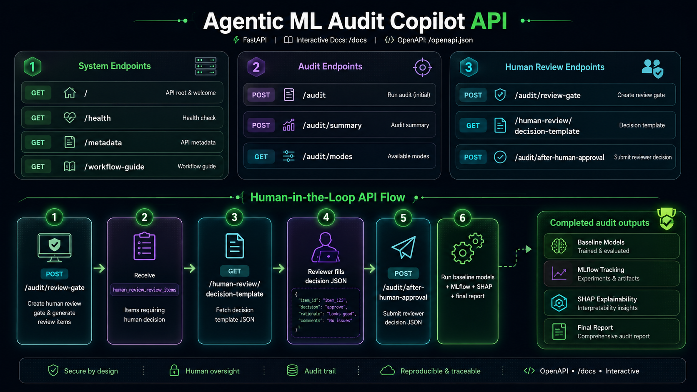

# Assets Guide

## Overview

The `assets/` directory contains the visual resources used in **Agentic ML Audit Copilot**.

These assets are used in the README, documentation, GitHub repository preview, project demo, Docker Hub page, Streamlit deployment references, and portfolio presentation.

The goal of this folder is simple:

- Keep project visuals organized
- Avoid duplicate screenshots
- Keep documentation paths consistent
- Make the repository look clean and professional
- Keep all visuals aligned with the current `v1.1.0` Human-in-the-Loop workflow

---

## Final Directory Structure

Use this structure:

```text
assets/
├── architecture/
│   ├── 01_system_architecture.png
│   ├── 02_hitl_workflow.png
│   └── 03_fastapi_workflow.png
│
├── branding/
│   └── repo_banner.png
│
├── demo/
│   ├── demo_git.gif
│   └── demo_script.md
│
└── screenshots/
    ├── 01_streamlit_home.png
    ├── 02_human_review_gate.png
    ├── 03_executive_dashboard.png
    └── 04_fastapi_docs.png
```

Do not add extra image folders unless the project really needs them.

---

## Branding Assets

| File | Purpose |
| --- | --- |
| `assets/branding/repo_banner.png` | Main GitHub README banner |

This image should appear at the top of `README.md`.

Example:

```md
<p align="center">
  
</p>
```

---

## Architecture Assets

| File | Purpose |
| --- | --- |
| `assets/architecture/01_system_architecture.png` | Full system architecture |
| `assets/architecture/02_hitl_workflow.png` | Human-in-the-loop review workflow |
| `assets/architecture/03_fastapi_workflow.png` | FastAPI and HITL API workflow |

These images explain the project without requiring the reader to inspect the code first.

Recommended README usage:

```md
## System Architecture

<p align="center">
  
</p>

## Human-in-the-Loop Workflow

<p align="center">
  
</p>

## FastAPI Workflow

<p align="center">
  
</p>
```

Recommended docs usage from files inside `docs/`:

```md
<p align="center">
  
</p>
```

---

## Screenshot Assets

| File | Purpose |
| --- | --- |
| `assets/screenshots/01_streamlit_home.png` | Streamlit home and dataset upload view |
| `assets/screenshots/02_human_review_gate.png` | Human Review Gate with risk cards and reviewer decisions |
| `assets/screenshots/03_executive_dashboard.png` | Executive dashboard with KPIs and audit status |
| `assets/screenshots/04_fastapi_docs.png` | FastAPI Swagger documentation |

These screenshots should be captured from the running application.

Recommended README usage:

```md
## Dashboard Screenshots

### Streamlit Home

<p align="center">
  
</p>

### Human Review Gate

<p align="center">
  
</p>

### Executive Dashboard

<p align="center">
  
</p>

### FastAPI Docs

<p align="center">
  
</p>
```

---

## Demo Assets

| File | Purpose |
| --- | --- |
| `assets/demo/demo_git.gif` | Short demo GIF for README |
| `assets/demo/demo_script.md` | Short demo notes or YouTube walkthrough script |

Example README usage:

```md
## Demo Preview

<p align="center">
  
</p>
```

---

## Screenshot Capture Checklist

Before taking screenshots, run the app locally.

Run Streamlit:

```bash
uv run streamlit run app/streamlit_app.py --server.port 8501
```

Run FastAPI in a second terminal:

```bash
uv run uvicorn app.api:app --reload --host 127.0.0.1 --port 8000
```

Or run both services with Docker:

```bash
docker run --rm \
  --name agentic-audit-copilot \
  -p 8501:8501 \
  -p 8000:8000 \
  -e GROQ_API_KEY="your_groq_api_key" \
  shivamrajput130/agentic-ml-audit-copilot:v1.1.0
```

Capture these views:

1. Streamlit home page after app loads
2. Human Review Gate tab after running an audit with review items
3. Executive dashboard after audit results are available
4. FastAPI Swagger UI at `http://127.0.0.1:8000/docs` or `http://localhost:8000/docs`

---

## Screenshot Quality Checklist

Before committing screenshots, check:

- The UI matches the current `v1.1.0` workflow.
- No real API keys are visible.
- No private file paths are visible.
- No private datasets or personal information are visible.
- Browser bookmarks and unrelated tabs are hidden if possible.
- The screenshot is readable on GitHub.
- The screenshot is not outdated compared with the current Streamlit UI.
- Human Gate screenshot clearly shows review decisions or review items.
- FastAPI screenshot shows the current HITL endpoints.

---

## Image Guidelines

Recommended format:

- PNG for banners, diagrams, and screenshots
- GIF for short demo previews
- Markdown for demo notes or scripts

Recommended aspect ratios:

| Asset Type | Recommended Ratio |
| --- | --- |
| Repository banner | 16:9 |
| Architecture diagrams | 16:9 |
| Dashboard screenshots | 16:9 or full browser width |
| Demo GIF | 16:9 |

Best practices:

- Keep screenshots clean.
- Avoid desktop clutter.
- Avoid browser bookmarks or private information.
- Use high-resolution captures.
- Keep labels readable.
- Prefer fewer strong visuals over many weak screenshots.
- Replace old screenshots after major UI changes.
- Keep file sizes reasonable so the repository stays lightweight.

---

## Naming Convention

Use numbered, lowercase, descriptive filenames.

Good examples:

```text
01_system_architecture.png
02_hitl_workflow.png
03_fastapi_workflow.png
01_streamlit_home.png
02_human_review_gate.png
03_executive_dashboard.png
04_fastapi_docs.png
repo_banner.png
demo_git.gif
demo_script.md
```

Avoid:

```text
Screenshot (1).png
final_latest.png
new_image.png
copy2.png
banner_final_final.png
youtube_demo.txt
```

---

## Updating Assets

When updating an asset:

1. Keep the same filename if the purpose is unchanged.
2. Replace the old file instead of adding duplicates.
3. Check README image paths after replacing.
4. Check documentation image paths after replacing.
5. Check Docker Hub or portfolio text if it references the same visual.
6. Run `git status` to confirm only intended files changed.

Useful command:

```bash
git status
```

Add assets:

```bash
git add assets/
```

Commit example:

```bash
git commit -m "Update project assets for v1.1.0"
```

---

## Paths Used in Documentation

From `README.md`, use paths like:

```text
assets/branding/repo_banner.png
assets/architecture/01_system_architecture.png
assets/architecture/02_hitl_workflow.png
assets/architecture/03_fastapi_workflow.png
assets/screenshots/01_streamlit_home.png
assets/screenshots/02_human_review_gate.png
assets/screenshots/03_executive_dashboard.png
assets/screenshots/04_fastapi_docs.png
assets/demo/demo_git.gif
```

From files inside `docs/`, use paths like:

```text
../assets/architecture/01_system_architecture.png
../assets/architecture/02_hitl_workflow.png
../assets/architecture/03_fastapi_workflow.png
../assets/screenshots/04_fastapi_docs.png
```

This path difference is important because documentation files are inside the `docs/` folder.

---

## What Not to Add

Do not add too many screenshots.

Avoid adding:

- Multiple similar dashboard screenshots
- Outdated UI screenshots
- Random generated images
- Temporary images
- Local system screenshots with private paths
- Screenshots showing API keys or secrets
- Screenshots showing private datasets
- Large files that slow down the repository
- Duplicate files with names like `final`, `new`, `copy`, or `latest`

The final asset set should stay small and strong.

---

## Final Asset Set

The recommended final visual set is:

```text
assets/branding/repo_banner.png
assets/architecture/01_system_architecture.png
assets/architecture/02_hitl_workflow.png
assets/architecture/03_fastapi_workflow.png
assets/screenshots/01_streamlit_home.png
assets/screenshots/02_human_review_gate.png
assets/screenshots/03_executive_dashboard.png
assets/screenshots/04_fastapi_docs.png
assets/demo/demo_git.gif
assets/demo/demo_script.md
```

This is enough for a clean, recruiter-friendly GitHub repository.

---

## Pre-Push Asset Check

Before pushing, run:

```bash
git status
```

Confirm these files exist:

```bash
ls assets/branding
ls assets/architecture
ls assets/screenshots
ls assets/demo
```

Expected key files:

```text
repo_banner.png
01_system_architecture.png
02_hitl_workflow.png
03_fastapi_workflow.png
01_streamlit_home.png
02_human_review_gate.png
03_executive_dashboard.png
04_fastapi_docs.png
demo_git.gif
demo_script.md
```

---

## Summary

The `assets/` directory should stay simple, organized, and consistent.

A small set of high-quality visuals is better than many repeated or outdated images. Keep the folder clean, keep filenames stable, and make sure all README and documentation image paths match the actual files.
